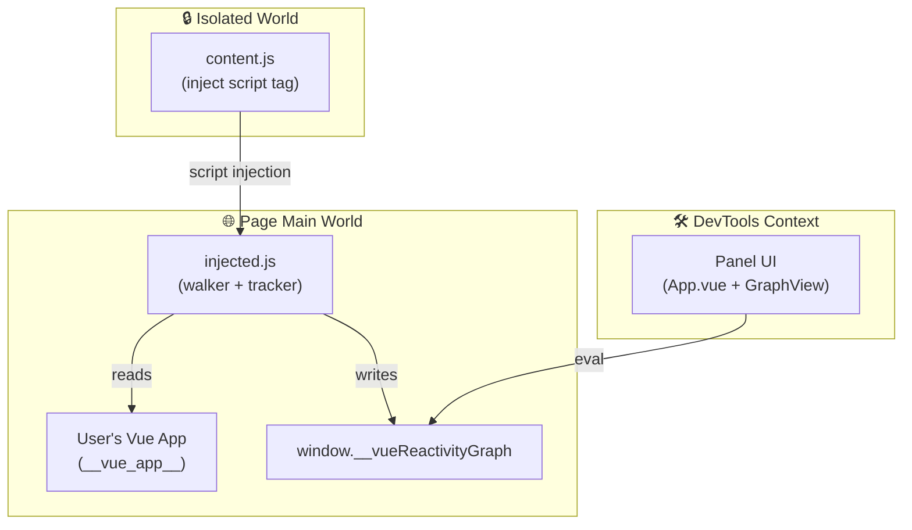
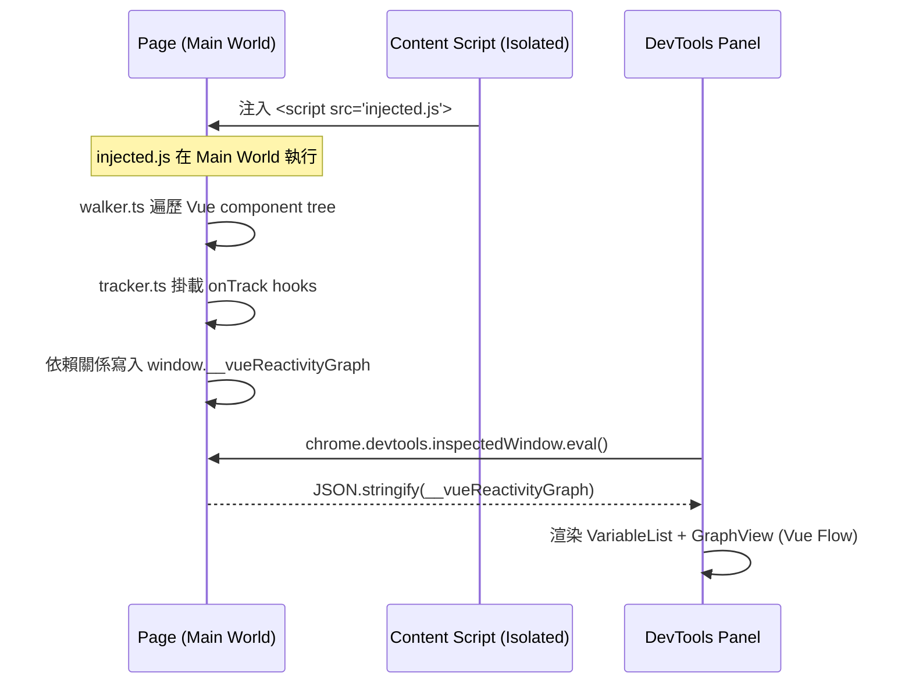

# Architecture

## 環境分層

專案橫跨三個隔離的瀏覽器執行環境：

## 資料流時序

## 各腳本職責

| 腳本 | 執行環境 | 職責 |
|------|----------|------|
| `content.js` | Isolated World | 將 `injected.js` 以 `<script>` 注入頁面 |
| `injected.js` | Page Main World | 遍歷 Vue tree、掛載 onTrack、建立 GraphNode |
| `devtools.html` | DevTools | 註冊 DevTools panel |
| `panel.js` | DevTools Context | 透過 `eval()` 讀取 graph、渲染 UI |

## 為什麼需要 injected 模式

Content script 運行在 Isolated World，無法存取頁面的 `window.__vue_app__`。
透過動態注入 `<script>` 標籤，讓腳本在 Page Main World 執行，才能讀取 Vue 的 internal reactive 狀態。
