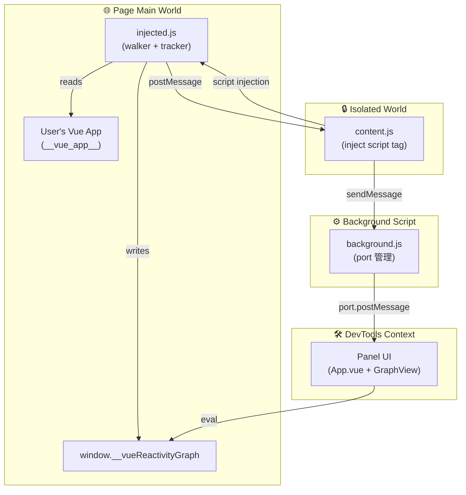
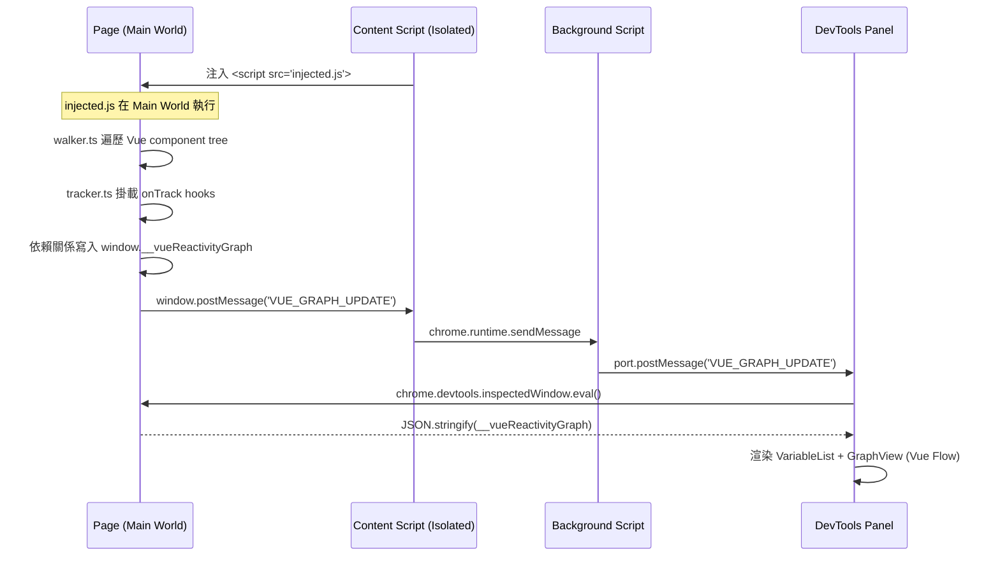
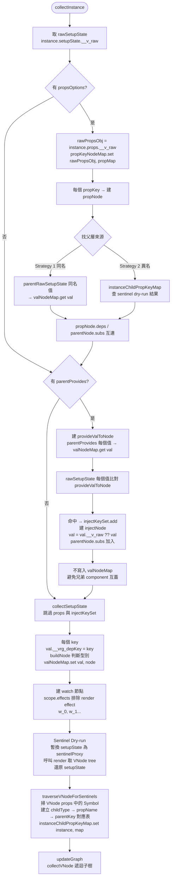
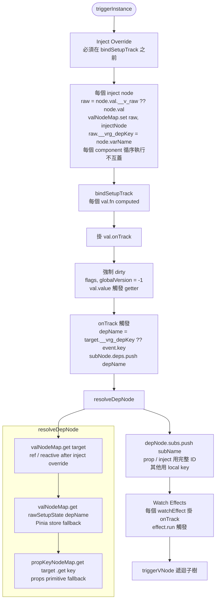

# Architecture

## 環境分層

專案橫跨三個隔離的瀏覽器執行環境：

## 資料流時序

## Component 解析流程

### Phase 1 — collectInstance（建節點，不觸發訂閱）

---

### Phase 2 — triggerInstance（掛 onTrack，手動觸發，填 deps / subs）

---

## 為什麼需要 injected 模式

Content script 運行在 Isolated World，無法存取頁面的 `window.__vue_app__`。
透過動態注入 `<script>` 標籤，讓腳本在 Page Main World 執行，才能讀取 Vue 的 internal reactive 狀態。

